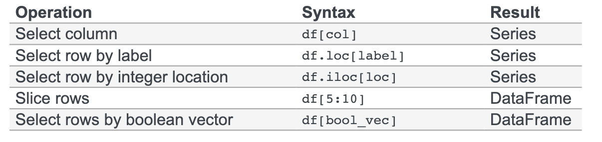

# Dimensions of Non Ordinary Experiences: Natural Language Processing of Transcendent Experience Reports

`EAS 499: Senior Thesis`

`University of Pennsylvania, Fall 2019`

#### Author: **Alex Tianheng Zhao**
> `alexzhao@seas.upenn.edu` 
> Department of Computer and Information, School of Engineering and Applied Science, University of Pennsylvania 
> Department of Statistics, The Wharton School, University of Pennsylvania 
> 🌐[`personal website`](https://alextzhao.io), [`github`](https://github.com/alextzhao), [`linkedin`](https://www.linkedin.com/in/alextzhao), [`ORCID`](https://orcid.org/0000-0001-6745-5980)

#### **Max Mintz, PhD** 
> `mintz@cis.upenn.edu` 
> Coordinator, Senior Thesis Program, Department of Computer and Information Science 
> University of Pennsylvania 

## **Thesis Advisors**
> **Chris Callison-Burch, PhD** 
> `ccb@upenn.edu`   
> Department of Computer and Information Science (SEAS), University of Pennsylvania 

> **Lyle Ungar, PhD** 
> `ungar@cis.upenn.edu`  
> Department of Computer and Information Science; additional appoints in the Departments of Bioengineering (SEAS); Genomics and Computational Biology (Penn Medicine); Operations, Informations, and Decisions (Wharton); Psychology (SAS), University of Pennsylvania

### **Useful Links:**
- Thesis Related:
    - [Thesis Master Document](https://docs.google.com/document/d/1dk1xXyfHqfdn5Tld-KZu7toiNYQeJHQv7BUlG7uSqP4/edit#)
    - [Thesis Scratch Paper](https://docs.google.com/document/d/1BP5Z2J9tJvRJB5J-hthQIGrdSnD0Bcvctd7kHqbUUKw/edit?usp=sharing)
    - [Thesis Codebase](https://github.com/alextzhao/psychedelicNLP)
    - [Thesis Interactive Jupyter Notebook](https://nbviewer.jupyter.org/github/alextzhao/psychedelicNLP/blob/master/AlexZhao_SeniorThesis_Notebook.ipynb)
- Helpful Tutorials and Tips
     - Excellent Series from `Towards Data Science`:
         - [A Practitioner's Guide to Natural Language Processing (Part I): Processing & Understanding Text](https://towardsdatascience.com/a-practitioners-guide-to-natural-language-processing-part-i-processing-understanding-text-9f4abfd13e72)
         - [Feature Engineering: Continuous Numeric Data](https://towardsdatascience.com/understanding-feature-engineering-part-1-continuous-numeric-data-da4e47099a7b)
         - [Feature Engineering: Categorical Data](https://homes.cs.washington.edu/~pedrod/papers/cacm12.pdf)
         - [Feature Engineering: Text Data Basics](https://towardsdatascience.com/understanding-feature-engineering-part-3-traditional-methods-for-text-data-f6f7d70acd41)
         - [Feature Engineering: Text Data Advanced](https://towardsdatascience.com/understanding-feature-engineering-part-4-deep-learning-methods-for-text-data-96c44370bbfa)
     - [A few userful things to know about machine learning](https://homes.cs.washington.edu/~pedrod/papers/cacm12.pdf)
     - [LDA: Excellent Talk by Christine Doig on Topic Models](http://chdoig.github.io/pygotham-topic-modeling/#/)
     - [Markdown Cheatsheet](https://github.com/adam-p/markdown-here/wiki/Markdown-Cheatsheet#links)
     - [Using R and Python together](https://stackoverflow.com/questions/39008069/r-and-python-in-one-jupyter-notebook); [python, R dataframe interoperability](https://rpy2.github.io/doc/latest/html/pandas.html); [R and python pipelining](https://blog.revolutionanalytics.com/2016/01/pipelining-r-python.html)
     - [Translate dplyr to pandas](https://pandas.pydata.org/pandas-docs/stable/getting_started/comparison/comparison_with_r.html)
     - [Basic pandas tutorial](https://pandas.pydata.org/pandas-docs/stable/getting_started/10min.html#min)
     - [Recommended dependencies for pandas](https://pandas.pydata.org/pandas-docs/stable/install.html#install-recommended-dependencies)
     - [Pandas: Working with Text Data](https://pandas.pydata.org/pandas-docs/stable/user_guide/text.html)
     - [sklearn reference](https://scikit-learn.org/stable/modules/classes.html): handy documentation, and provides broad-strokes ontology for machine learning techniques
     - [Introduction to Machine Learning with sklearn](https://scikit-learn.org/stable/tutorial/basic/tutorial.html)
     - [Sample pipeline for text feature extraction and evaluation](https://scikit-learn.org/stable/auto_examples/model_selection/grid_search_text_feature_extraction.html#sphx-glr-auto-examples-model-selection-grid-search-text-feature-extraction-py): using `sklearn`
     - [Comparison of performances of different classifiers](https://scikit-learn.org/stable/auto_examples/classification/plot_classifier_comparison.html#sphx-glr-auto-examples-classification-plot-classifier-comparison-py): from `sklearn`, super cool
     - TODO: [Citing sklearn](https://scikit-learn.org/stable/about.html#citing-scikit-learn)
     - [Contributing to sklearn](https://scikit-learn.org/stable/developers/contributing.html)
     - [Manually Creating a table of contents](https://medium.com/@sambozek/ipython-er-jupyter-table-of-contents-69bb72cf39d3)
     - [Automaticaly Creating Table of Contents](https://jupyter-contrib-nbextensions.readthedocs.io/en/latest/nbextensions/toc2/README.html)
     - [Python Data Science Handbook](https://github.com/jakevdp/PythonDataScienceHandbook): Free Jupyter Notebooks
     - [Configuring jupyter notebook with extensions](https://github.com/Jupyter-contrib/jupyter_nbextensions_configurator)
- Publishing my thesis:
    - [Jupyter Notebook Viewer](https://nbviewer.jupyter.org/)

- Notes to self:
    - `~/opt/anaconda3/lib/python3.7/site-packages/jupyter_contrib_nbextensions/nbextensions/toc2` path to nbextensions toc2
    - [fixing nbextensions](https://github.com/ipython-contrib/jupyter_contrib_nbextensions/issues/1090)
